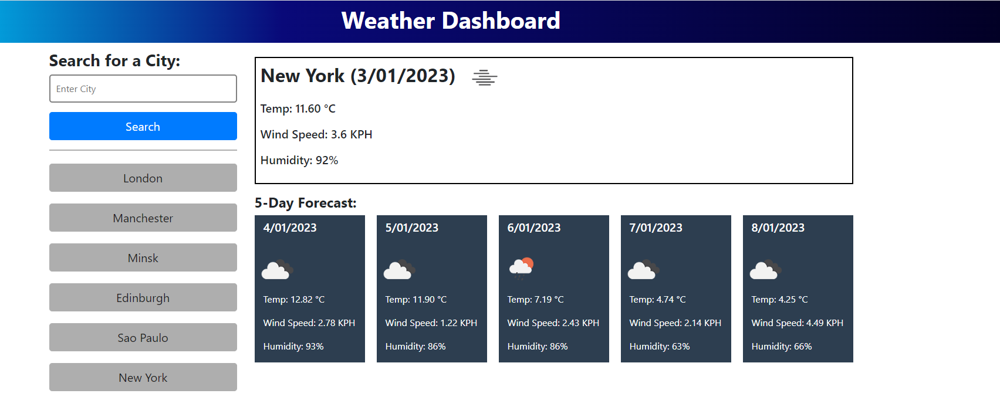
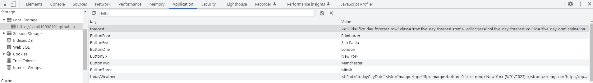
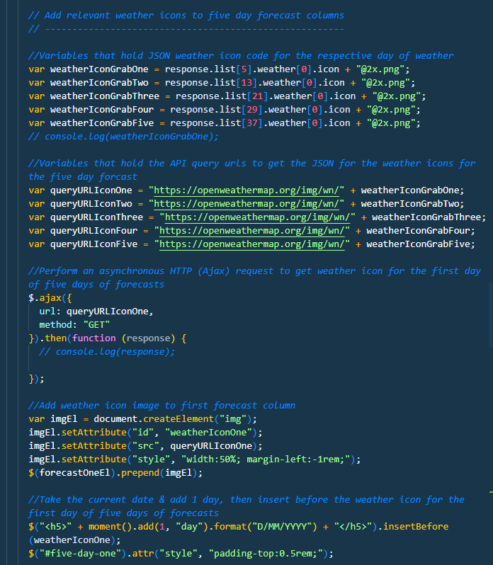
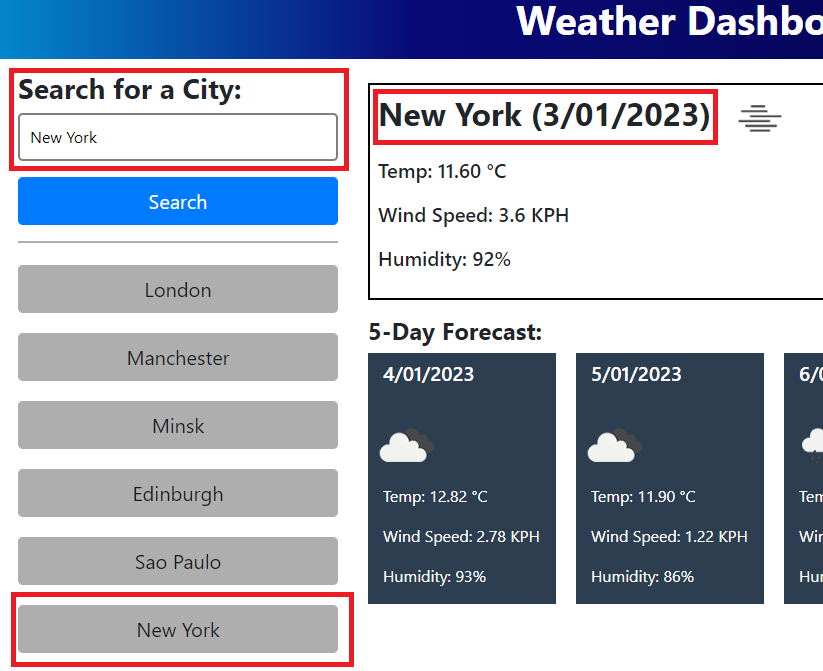

# Weather Dashboard
This is my weather dashboard.

## Description 
Using the OpenWeather API I have developed a weather dashboard that enables the user to enter a city via a text input to receive a current weather report and a five day weather forecast for each city input.

Temperature, windspeed & Humidity are displayed along with weather icons. All data is retrieved from the OpenWeather API using multiple Ajax get methods that retrieve JSON for the searched city before appending it to the relevant HTML IDs (in some cases prepending). Most of the dashboard is generated using JavaScript.

Search history is stored to Local Storage and assigned to search buttons for quick access to weather data for previously searched cities .

<i>Weather dashboard as it appears in the browser</i>

<i>Local Storage showing the keys & values</i>

<i>Script.js - The ajax API get method used to retrieve the relevant weather icons for the five day forecast</i>

### Here is the deployed site; 
https://sam010000101.github.io/weather-dashboard/

## Table of Contents

* [Installation](#installation)
* [Usage](#usage)
* [Credits](#credits)
* [License](#license)

## Installation
N/A

## Usage
1. Type a city location into the input field & 'click' on the search button.
2. The current weather section (top of dashboard) will show the city location, today's date and details of the current weather in that location.
3. A 5-Day Forecast will also be generated for the searched city (bottom of dashboard)
4. The searched city will be added to the next History Button.
5. History Buttons provide a quick way to recall weather for a previously searched city.
&nbsp;

## Credits
The early development on this project was created in collaboration with my teammates;

 Paul Ashby https://github.com/paulashby
 
 Dayo Adekunle https://github.com/Data202

 Damien N. Ayine https://github.com/Damiennsoh

## License

MIT License

Copyright (c) 2022 Sam Brooke

Permission is hereby granted, free of charge, to any person obtaining a copy
of this software and associated documentation files (the "Software"), to deal
in the Software without restriction, including without limitation the rights
to use, copy, modify, merge, publish, distribute, sublicense, and/or sell
copies of the Software, and to permit persons to whom the Software is
furnished to do so, subject to the following conditions:

The above copyright notice and this permission notice shall be included in all
copies or substantial portions of the Software.

THE SOFTWARE IS PROVIDED "AS IS", WITHOUT WARRANTY OF ANY KIND, EXPRESS OR
IMPLIED, INCLUDING BUT NOT LIMITED TO THE WARRANTIES OF MERCHANTABILITY,
FITNESS FOR A PARTICULAR PURPOSE AND NONINFRINGEMENT. IN NO EVENT SHALL THE
AUTHORS OR COPYRIGHT HOLDERS BE LIABLE FOR ANY CLAIM, DAMAGES OR OTHER
LIABILITY, WHETHER IN AN ACTION OF CONTRACT, TORT OR OTHERWISE, ARISING FROM,
OUT OF OR IN CONNECTION WITH THE SOFTWARE OR THE USE OR OTHER DEALINGS IN THE
SOFTWARE

---

## Badges

## Tests

---

© 2022 Trilogy Education Services, LLC, a 2U, Inc. brand. Confidential and Proprietary. All Rights Reserved.
# Bootstrap-Portfolio
